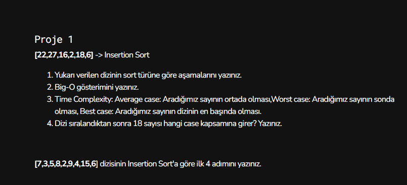

# Veri Yapıları Ve Algoritmalar Projeleri
## Proje1

### 1 - Yukarıda verilen dizinin sort türüne göre aşamalarını yazınız.

### aşamalar :
1: [22,27,16,2,18,6] İlk sayımızdan başlarız. Sayımızın sağındaki ifadeyi sayımız ile karşılaştırırız.Küçük ise sayımızın ve kalan sayıların sol tarafına doğru geçiş yapar.
2: [22,16,27,2,18,6]
3: [16,22,27,2,18,6]
4: [2,16,22,27,18,6]
5: [2,16,18,22,27,6]
6: [2,6,16,18,22,27]

### 2 - Big-O gösterimi

n!=n*(n+1)/2=>O(n^2)

### 3 - Time Complexity

Average case: n^2
Worst case: n^2
Best case: n^2

### 4 Dizi sıralandıktan sonra 18 sayısı hangi case kapsamına girer?

Dizi sıralandıktan sonra 18 sayısı dizinin ortalarında olur.Bu sebeple Average Case kapsamına girer

### [7,3,5,8,2,9,4,15,6] dizisinin Insertion Sort'a göre ilk 4 adımını 

1: [7,3,5,8,2,9,4,15,6] --> 2ci eleman secilir ve karsilastirma yapilir
2: [3,7,5,8,2,9,4,15,6] --> 3cu eleman secilir ve karsilastirma yapilir
3: [3,5,7,8,2,9,4,15,6] --> 4cu eleman secilir ve karsilastirma yapilir
4: [3,5,7,8,2,9,4,15,6] --> 5ci eleman secilir ve karsilastirma yapilir

| Syntax | Description |
| ----------- | ----------- |
| Header | Title |
| Paragraph | Text |
